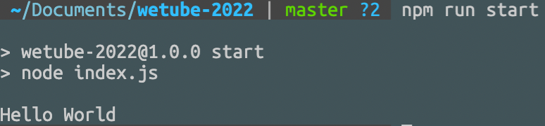
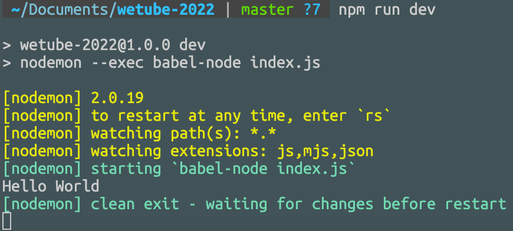

# Building Project

## 1. 프로젝트 폴더 생성 후 터미널에서 `npm init`

아래와 같은 `package.json` 파일이 생성된다.

```javascript
// pacakge.jon
{
  "name": "wetube-2022",
  "version": "1.0.0",
  "description": "Youtube Cloning",
  "main": "index.js",
  "scripts": {
    "test": "echo \"Error: no test specified\" && exit 1"
  },
  "repository": {
    "type": "git",
    "url": "git+https://github.com/empodi/wetube-2022.git"
  },
  "author": "Empodi",
  "license": "MIT",
  "bugs": {
    "url": "https://github.com/empodi/wetube-2022/issues"
  },
  "homepage": "https://github.com/empodi/wetube-2022#readme"
}

```

<br>

## 2. NodeJs 실행

`package.json`의 `main`을 보면 `index.js`라고 되어있다. index.js 파일을 생성한 후 터미널에 `node index.js`를 입력하면 된다.

```
wetube-2022
├─ .gitignore
├─ index.js
└─ package.json
```

```javascript
// index.js

console.log("Hello World");
```

터미널에 **Hello World**가 출력되면 OK.

<br>

## 3. 스크립트 사용

`package.json`의 `script` 부분에 아래 코드를 추가한다.

```javascript
"scripts": {
    "start": "node index.js",	// 새로 추가한 부분
    "test": "echo \"Error: no test specified\" && exit 1"
  },
```

터미널에 `npm run start`를 입력하면 index.js가 정상적으로 실행된다. start 말고 마음대로 정해도 된다.



<br>

## 4. EXPRESS

터미널에 `npm i express` 입력하면 `node_modules` 폴더와 `package-lock.json` 파일이 생성된다. 'i' 는 install을 의미한다.  
그리고 `package.json` 폴더에 `dependencies` 부분을 보면 **express**가 추가된 것을 확인할 수 있다.  
`dependencies`에 추가된 것은 나중에 `npm i`만 해줘도 자동으로 프로젝트에 설치된다.

```
wetube-2022
├─ node_modules
├─ .gitignore
├─ index.js
├─ package-lock.json
└─ package.json
```

node_modules 폴더는 .gitignore에 추가한다.

<br>

## 5. Babel

`Babel`은 자바스크립트 컴파일러다. 브라우저가 이해하지 못하는 자바스크립트 최신 문법을 브라우저가 이해할 수 있도록 바꿔준다.

- 콘솔에 `npm install --save-dev @babel/core` 와 `npm install @babel/preset-env --save-dev` 입력

`package.jon`의 `devDependencies`에 **babel**이 추가된 것을 확인할 수 있다.  
`devDependencies`에 추가된 것 또한 나중에 `npm i`만으로도 자동으로 프로젝트에 설치된다.

`babel.config.json` 파일을 생성하고 아래 코드를 추가한다.

```javascript
{
  "presets": ["@babel/preset-env"]
}
```

```
wetube-2022
├─ .gitignore
├─ index.js
├─ babel.config.json
├─ package-lock.json
└─ package.json
```

콘솔에 `npm install @babel/node --save-dev` 를 입력한다.  
이후 `package.json`의 `devDependencies`에 **@babel/node**가 생긴 것을 확인하고  
`script` 부분에 아래와 같이 입력한다.

```javascript
  "scripts": {
    "start": "node index.js",
    "dev": "babel-node index.js",	// 새로 입력
    "test": "echo \"Error: no test specified\" && exit 1"
  },
```

`npm run dev` 를 콘솔에 입력하면 **Hello World**가 출력된다.

마지막으로 `nodemon`을 설치한다.  
`nodemon`은 자동으로 소스코드의 변화를 감지하여 node를 재시작한다.

`npm i nodemon --save-dev` 입력
이후 `package.json`의 `script`를 아래와 같이 수정

```javascript
  "scripts": {
    "start": "node index.js",
    "dev": "nodemon --exec babel-node index.js",	// 수정
    "test": "echo \"Error: no test specified\" && exit 1"
  },
```

콘솔에 `npm run dev`를 입력하면 아래와 같이 node가 실행된다.



BABEL 설치는 아래 링크에서 `Node`와 `Nodemon` 순으로 선택해서 하면 된다.  
[BABEL](https://babeljs.io/setup#installation)

아래는 최종 코드 깃헙 링크  
[Github](https://github.com/empodi/wetube-2022/commit/af56a656cb3ed49346e6d4b7265f68b47a51a224)
