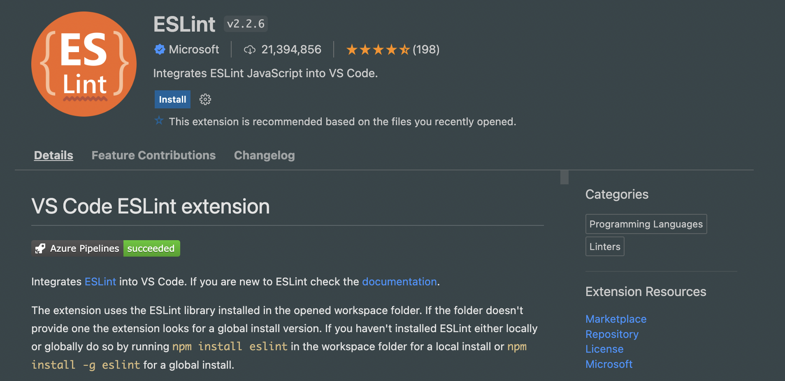
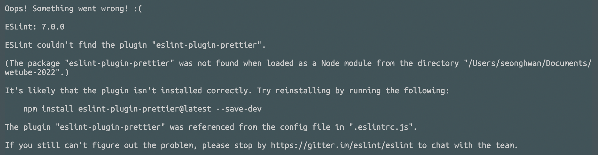
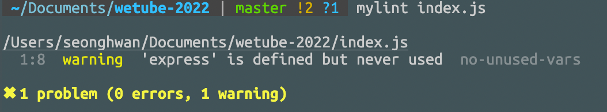

# ESLint

강의에는 없지만 혼자 추가해본다!!

아래 링크를 참조했다.

[Link](https://helloinyong.tistory.com/325)

`npm install -D eslint` 로 eslint 설치

vscode에서 eslint-extension 설치



그리고 `.eslintrc.js` 파일을 만들어 아래와 같이 작성하였다.구글에서 긁어옴.

```javascript
module.exports = {
  env: {
    browser: true,
    es6: true,
  },
  extends: ["eslint:recommended", "plugin:prettier/recommended", "prettier"],
  globals: {
    Atomics: "readonly",
    SharedArrayBuffer: "readonly",
  },
  parserOptions: {
    ecmaVersion: 2018,
    sourceType: "module",
  },
  rules: {
    indent: ["warn", 4],
    "no-unused-vars": 1,
    "no-use-before-define": 1,
    "no-redeclare": 1,
    "no-console": 0,
  },
};
```

<br>

현재 **prettier**를 사용하고 있기 때문에 **eslint**와 충돌하지 않도록  
`eslint-config-prettier`를 설치하였다.

아래 깃헙 링크를 참고하면 된다.

[Link](https://github.com/prettier/eslint-config-prettier)

<br>

eslint를 실행하려면 아래와 같이 콘솔에 입력하면 된다.

`./node_modules/.bin/eslint your-file.js`

근데 오류가 떴다.



`eslint-plugin-prettier` 를 설치하란다.

`npm i eslint-plugin-prettier@latest --save-dev` 를 해주었다.

`./node_modules/.bin/eslint your-file.js` 명령어가 너무 길어서 .zshrc에 **mylint**로 alias를 추가하였다.

> alias mylint="./node_modules/.bin/eslint"

마지막으로 index.js를 아래와 같이 작성한 후 실행하였다.

```javascript
// index.js
import express from "express";

console.log("Hello World");
```



정상적으로 실행되었다.

최종적인 `package.json`의 `devDependencies`는 아래와 같다.

```javascript
"devDependencies": {
    "@babel/core": "^7.18.9",
    "@babel/node": "^7.18.9",
    "@babel/preset-env": "^7.18.9",
    "eslint": "^7.0.0",
    "eslint-config-prettier": "^8.5.0",
    "eslint-plugin-prettier": "^4.2.1",
    "nodemon": "^2.0.19"
  }
```

```
wetube-2022
├─ .eslintrc.js
├─ README.md
├─ babel.config.json
├─ index.js
├─ package-lock.json
└─ package.json
```

또 참고한 링크  
[npm-eslint](https://www.npmjs.com/package/eslint/v/7.0.0)

아래는 최종 코드 깃헙 링크  
[Github](https://github.com/empodi/wetube-2022/commit/b6033a4738101186739852df734fff7c7f83698d)
