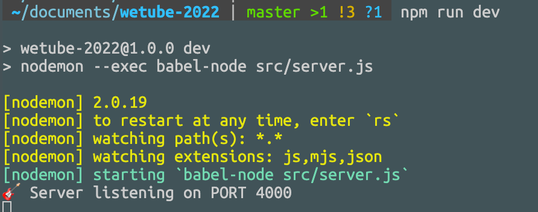

# First Server

index.js의 이름을 `server.js`로 바꾸고 새로 만든 source 폴더에 넣었다.

```
wetube-2022
├─ .eslintrc.js
├─ README.md
├─ babel.config.json
├─ package-lock.json
├─ package.json
└─ src
   └─ server.js

```

`package.json`의 `script`의 `dev` 부분도 아래와 같이 바꾸었다.

```javascript
"dev": "nodemon --exec babel-node src/server.js",
```

---

<br>

`server.js` 를 아래와 같이 작성하였다.

```javascript
import express from "express";

const app = express();
const PORT = 4000;

const handleListen = () => console.log(`🎸 Server listening on PORT ${PORT}`);

app.listen(PORT, handleListen);
```

`npm run dev` 를 콘솔에 입력하면



브라우저에 localhost:4000 주소로 접속하면
빈 창에 `Cannot GET / ` 이라 뜬다.

따라서 express app에 HTTP Get 메소드를 추가해야 한다.

```javascript
import express from "express";

const app = express();
const PORT = 4000;

// first parameter: path
// second parameter defines a route handler
app.get("/", (req, res) => {
  return res.send("SERVER!!");
});

const handleListen = () => console.log(`🎸 Server listening on PORT ${PORT}`);

app.listen(PORT, handleListen);
```

위와 같이 index.js 를 작성하면 서버가 반응을 하기 시작한다.

`app.get()` 함수는 Get 요청의 경로와 그에 대한 핸들러를 정의한다. 위 코드의 `app.get()` 함수는 `localhost:4000/`에 접속했을 때 "Server!!"를 띄워준다.

---
