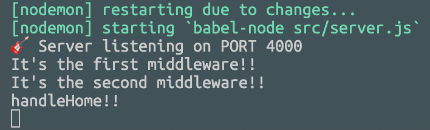

# Middleware

server.js를 아래와 같이 다시 작성할 수 있다.

```javascript
import express from "express";

const app = express();
const PORT = 4000;

const handleHome = (req, res) => res.send("SERVER!!!");

app.get("/", handleHome);

const handleListen = () => console.log(`🎸 Server listening on PORT ${PORT}`);

app.listen(PORT, handleListen);
```

app.get 함수에 handleHome 이라는 콜백함수를 추가하였다.

여기서 handleHome 함수가 Middleware가 된다.

---

<br>

## Middleware 함수는 request-response cycle에서 `req`, `res`에 대한 접근 권한을 제공한다.

예를 들어 어떤 사용자가 서버에 로그인을 하면 해당 유저에 대한 정보가 `res.user`에 저장될 수 있다.

handleHome 함수는 `req`, `res` 라는 **Express Standard Parameter** 를 넘겨 받는다. 이는 express에서 직접 넘겨주는 **object**이다.

`req`는 클라이언트로부터의 요청을 의미한다(request). 라우터 핸들러 함수가 클라이언트의 요청에서 데이터를 추출할 때 사용할 수 있다.

`res`는 서버가 클라이언트의 요청에 대응하는 것을 의미한다 (response). 라우터 핸들러 함수가 클라이언트에게 데이터(일반적으로 json format)를 보낼 때 사용한다.

사실 파라미터가 하나 더 있다.

```javascript
const handleHome = (req, res, next) => res.send("SERVER!!!");
```

위 코드를 보면 `next` 파라미터가 추가되었다. 이는 다른 **Middleware**를 호출하기 위해 사용된다.

이렇게 여러 개의 **Middleware** 들이 연쇄적으로 호출되는 것을 `middleware chain`이라 한다. 이 체인의 마지막 함수는 꼭 response를 클라이언트에게 전달해야 한다. `req`, `res`의 변경 사항은 그 다음 middleware 호출에서도 반영이 된다. 또한 `req`, `res` object은 각각의 요청마다 독립적이다.

> 만약 middleware chain의 마지막 함수가 아닌 함수에서 next()를 호출하지 않으면 클라이언트가 보낸 리퀘스트 처리가 멈추고 결국엔 timeout이 뜬다.

---

<br>

## app.use()

app.get() 함수 외에도 app.use() 함수가 있다. 이는 **middleware**를 해당 어플리케이션에 바인딩하기 위한 함수이다.

```javascript
// index.js
import express from "express";

const app = express();
const PORT = 4000;

const handleHome = (req, res) => {
  console.log("handleHome!!");
  return res.send("SERVER!!!");
};
const firstMiddleware = (req, res, next) => {
  console.log("It's the first middleware!!");
  next();
};
const secondMiddleware = (req, res, next) => {
  console.log("It's the second middleware!!");
  next();
};

app.use("/", firstMiddleware);
app.use("/", secondMiddleware);
app.get("/", handleHome);

const handleListen = () => console.log(`🎸 Server listening on PORT ${PORT}`);

app.listen(PORT, handleListen);
```

위와 같이 코드를 작성하면 아래와 같은 결과가 나온다.



app.use() 함수로 firstMiddleware와 secondMiddleware를 바인딩 하였고 **next() 함수를 호출** 하여 다음 클라이언트 요청이 다음 middleware로 넘어가게 해주었다. 만약 next() 호출을 하지 않으면 브라우저 스피너가 계속 돌게 된다.

**app.use() 함수는 코드 상에서 언제나 app.get() 함수 위에 있어야 한다!!!**

<br>

## Return Response Object

response object을 반환하는 방법은 여러 가지가 있다.

- `res.end()`: 데이터 전송 없이 response를 끝낸다.
- `res.send([body])`: HTTP response를 반환한다. 하나의 파라미터만 허용되며 파라미터는 Buffer object, 스트링, object, 배열 등이 가능하다. res.send()는 res.end()를 포함한다.
- `res.redirect([status, ] path)`: HTTP status code와 리다이렉트할 경로를 파라미터로 가질 수 있다. res.end()를 포함한다.
- `res.render(view, [, locals] [, callback])`: view를 렌더하기 위해 사용되며 렌더링된 HTML string을 클라이언트에게 반환한다. 두 가지 파라미터가 허용되며 locals는 view를 위한 local property(.ejs, .pug etc.)를 의미한다. 다른 하나는 callback 함수이다.

**클라이언트 요청에 대한 응답은 한 번만 해야한다!!**

---

<br>

[최종 코드 깃헙 링크](https://github.com/empodi/wetube-2022/commit/103c61574bb4deeb4165d66ac23dbf2b5b9a92de)

<br>

참고 링크  
[Link](https://medium.com/@jamischarles/what-is-middleware-a-simple-explanation-bb22d6b41d01)  
[Link](https://stackoverflow.com/questions/31928417/chaining-multiple-pieces-of-middleware-for-specific-route-in-expressjs)  
[Link](https://discuss.codecademy.com/t/whats-the-significance-of-the-req-res-next-callback/565775)  
[Link](https://stackoverflow.com/questions/29555290/what-is-the-difference-between-res-end-and-res-send)  
[Link](https://www.geeksforgeeks.org/difference-between-app-use-and-app-get-in-express-js/)  
[Link](https://www.geeksforgeeks.org/express-js-res-send-function/)  
[Link](https://www.geeksforgeeks.org/express-js-res-render-function/?ref=lbp)
